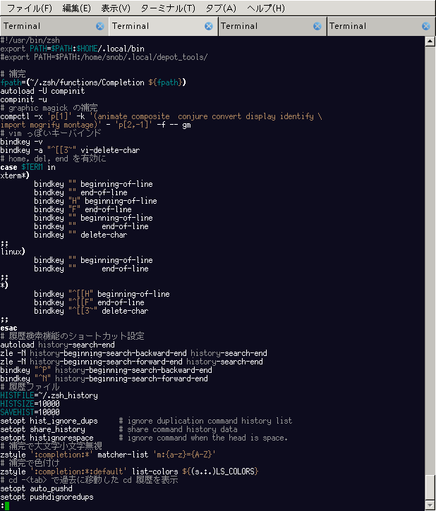

# less で syntax highlight

## 一番簡単、vim マクロ

/usr/share/vim/vim74/macros/less.sh を alias か何かで使うのが一番簡単。ただし、個人的には
less の -X オプション、終了時に画面をクリアしない、を使っているのだけど、それは出きない（
と思う）。

--> クリアしないようにできる。:help norestorescreen に従って

```vim
set t_ti= t_te=
```

色は vim と統一できるので、統一感はある。makrdown.vim に previm が使われていて、エラーが出
るが、markdown.vim も previm も使わないから削除した。


## pygments を使う。

Python module の一つ。http://is.gd/acvG5m にある。通常の python module と同じで

```sh
python setup.py build
python setup.py install
```
でインストールできる。

使い方は

```sh
pygmentize -f 256 -g -O style=fruity .zshrc 
```

less には

```sh
export LESS="-RX"
export LESSOPEN='| pygmentize -O style=trac -f 256 -g  %s'
```

256 は 256色ターミナル向け、-g はファイルタイプ自動識別。スタイルは trac, native, tango,
friendly, paraiso-dark, trac あたりが好み。

pygments_screenshots/ にスクリーンショットを置いておく。



<!-- vim: set tw=90 filetype=markdown : -->

